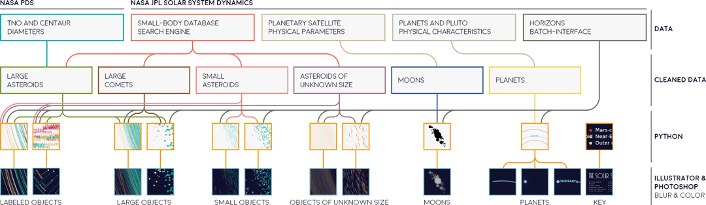
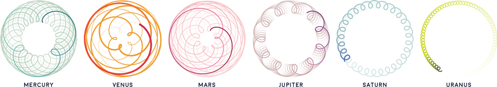
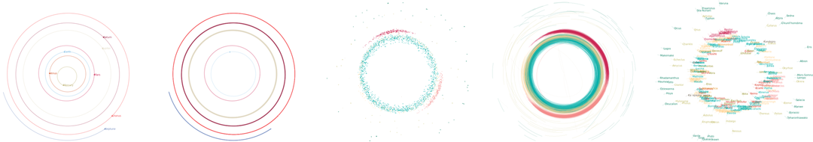
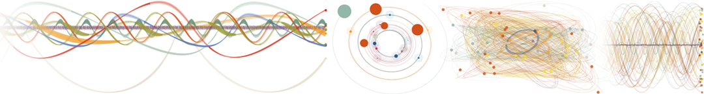
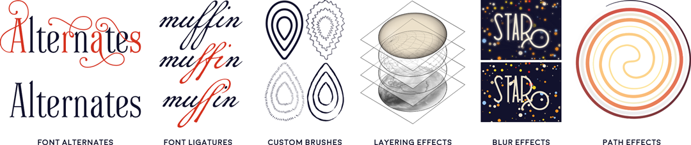
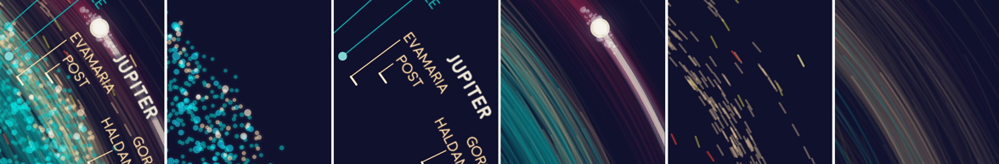
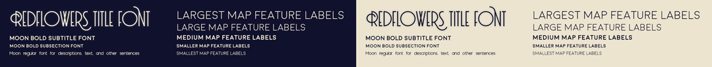

# Mapping The Solar System

[](https://www.gnu.org/licenses/gpl-3.0)
[](https://twitter.com/eleanor_lutz)
[](https://github.com/eleanorlutz)
[](https://www.paypal.com/cgi-bin/webscr?cmd=_donations&business=KAMHYBDBTH7XU&currency_code=USD&source=url)

This repository explains how to make a map of the solar system using open-source code and data from NASA. Software used includes `Python 3.7.1`, `NASA HORIZONS`, `Illustrator CC 2019` and `Photoshop CC 2019`. If you have comments or suggestions for this tutorial, please let me know [on my blog](http://tabletopwhale.com/2019/06/10/the-solar-system.html)! You can buy the [finished map here](https://www.redbubble.com/people/eleanorlutz/works/39373641-an-asteroid-map-of-the-solar-system).

**Python dependencies:** `matplotlib` `astropy` `numpy` `pandas` `os` `time` `urllib`. Dependencies can be installed with `pip install -r requirements.txt`.


## Special instructions for beginners

##### If you're new to coding:

[Software Carpentry](https://software-carpentry.org/) has great tutorials for [installing Python](https://carpentries.github.io/workshop-template/) (scroll down and follow the directions in  the Bash Shell and Python sections), [getting starting with Jupyter Notebooks](http://swcarpentry.github.io/python-novice-inflammation/setup/index.html), and [beginner-friendly Python programming](http://swcarpentry.github.io/python-novice-inflammation/aio/index.html). After you've installed Python using these tutorials, you can use [Git Desktop](https://desktop.github.com/) and the instructions in [this tutorial](https://help.github.com/en/desktop/contributing-to-projects/cloning-a-repository-from-github-desktop) to download the code and data in this tutorial.

##### If you're new to design:

You'll need software for editing raster and vector images ([this article](https://vector-conversions.com/vectorizing/raster_vs_vector.html) explains the difference). I use [Adobe Photoshop](https://www.adobe.com/products/photoshop.html) and [Illustrator](https://www.adobe.com/products/illustrator.html), but you can also use the free open-source programs [Gimp](https://www.gimp.org/downloads/) and [Inkscape](https://inkscape.org/release/inkscape-0.92.4/). There is no perfect software that fits everyone's needs, so you'll want to understand the pros and cons for the different [raster](https://www.colorexpertsbd.com/blog/brief-comparison-photoshop-gimp) and [vector](https://logosbynick.com/inkscape-vs-illustrator-vs-coreldraw/) programs before choosing.

## Table of Contents

1. [Gathering and processing data](#data)
2. [Map design in Python](#python)
3. [Map design in Illustrator and Photoshop](#illustrator_photoshop)
4. [References](#references)
5. [License](#license)

<a name="data"/>

## Gathering and processing data



#### Small-Body Database Search Engine

This map combines five different datasets from NASA PDS and NASA JPL. The primary dataset at the core of the project is the NASA [JPL Small-Body Database Search Engine](https://ssd.jpl.nasa.gov/sbdb_query.cgi), which I used to make a list of all known asteroids and comets in the solar system. To use this search engine, go to the linked website, fill in the data fields you want to request, and then download the data as a CSV. For this project, these were the data fields I requested:

- `object internal database ID `, `object primary SPK-ID`, `object full name/designation`, `object primary designation`: These were all of the available ID formats for asteroids and comets. I downloaded all of them in case I needed to join or reference different datasets later on in the project.
- `object IAU name`: This is the common name of the object. I used this data to annotate the map with labels.
- `comet designation prefix`, `Near-Earth Object (NEO) flag (Y/N)`, `Potentially Hazardous Asteroid (PHA) flag (Y/N)`, `orbit classification`: At first I wasn't sure what kind of color scheme or symbols I'd use for the map, so I downloaded all interesting-sounding parameters so I could look at them later. In the end I used orbit classifications to determine the color. The rest I didn't end up using, since the information was more or less similar to the orbit classifications.
- `object diameter (from equivalent sphere) (km)`: This is the diameter of each object (not all objects have a known diamater). In this map, each asteroid or comet is plotted proportional to its actual size on a log scale.
- `[q] perihelion distance (au)`: The perihelion distance is the closest distance from the object to the sun. I didn't use this data directly in the map, but I used this information to get an initial idea of the distribution of objects in the solar system.
- `sidereal orbital period (d)`: I use this data to customize the HORIZONS query time range for each object. For most objects I wanted to get the orbit path for a time period of 10 years. But for asteroids that move very quickly, I asked for a maximum of 1/4 the length of a full orbit.

I first downloaded this data into `all_asteroids.csv` and `all_comets.csv`. Next, I added in some missing data from the **TNO Diameter Dataset** (described below) and saved the result in `all_asteroids_wrangled.csv` and `all_comets_wrangled.csv`. Finally, I split the dataset into separate files for large asteroids >20km `large_asteroids.csv`, small asteroids 10-20km `small_asteroids.csv`, and asteroids of unknown size `any_inner_asteroids.csv` and `any_outer_asteroids.csv`. Since there were only 12 comets >10km, I combined all of them into one data file `large_comets.csv`.

#### Trans-Neptunian Object (TNO) Diameter Dataset

The JPL Small-Body Database doesn't seem to include diameter sizes for Trans-Neptunian Objects such as Pluto. I found this information in the [TNO and Centaur Diameters, Albedos, and Densities](https://sbn.psi.edu/pds/resource/tnocenalb.html) dataset from the NASA Planetary Science Institute, and merged it into the records downloaded from the Small-Body Database. Overall I found this dataset difficult to clean, so I might have made mistakes - please use the altered data with caution. These are the cleaning steps I used:

- In some columns, missing values are marked with `-99.999`, `-9.999`, `-999.9`, or some other such variant. Some diameters are also marked with a negative value (but are actual values, not `999`). I wasn't quite sure what these values meant, but regardless I removed any diameter values below 0.
- The designation ID is missing for Pluto, so I added the ID manually: `134340 Pluto`.
- This dataset contains multiple measurements per object, each one from a different scientific study. I used the median value for each object after removing studies with missing diameter values.
- The data appears to be a tab-delimited `.tab` file, but I couldn't find any tabs in either Python or text editing software. So I split the rows as best as I could by whitespace, but this caused several other issues:
  - In some columns, missing values are marked with a space, which was indistinguishable from delimiter whitespace. I manually replaced these spaces with `-` to mark missing data.
  - A couple objects have names with more than one word. I manually deleted the spaces on all these names so the columns would align on whitespace.

#### Planet and Moon Datasets

Planets and moons are not considered "small bodies", so they aren't included in the Small-Body Database. For planets and moons, I compiled two separate `CSV` files containing data for [planets](https://ssd.jpl.nasa.gov/?planet_phys_par) and [moons](https://ssd.jpl.nasa.gov/?sat_phys_par) using data published by the JPL Solar System Dynamics group and the [NASA Space Science Data Coordinated Archive](https://nssdc.gsfc.nasa.gov/planetary/factsheet/): `moons.csv`
and `planets.csv`.

#### Orbit Trajectory Dataset

You can calculate the position of asteroids based on  Keplerian orbital elements in the Small-Body Database, but most of the [tutorials I found](http://www.planetary.org/blogs/emily-lakdawalla/2012/3380.html) seemed to recommend using NASA HORIZONS instead. Additionally, the Keplerian element estimate doesn't take into account the gravitational fields of nearby objects, so I wanted to use the more accurate position data generated by HORIZONS.

##### The HORIZONS Web-Interface

The JPL HORIZONS system generates ephemerides for solar system objects (ephemerides describe movement trajectories over time). It can be accessed in several different ways, and the [Web-Interface](https://ssd.jpl.nasa.gov/horizons.cgi) is probably the most user-friendly. To use the Web-Interface, fill in the `Target Body`, `Observer Location`, and `Time Span` Settings and click `Generate Ephemeris`. For example, to  find the path of Venus as seen from Earth, set the  `Observer Location` to `Geocentric` and the `Target Body` to `Venus`:



##### The HORIZONS Batch-Interface

The Web-Interface is great for single searches, but I needed the orbital trajectories of several thousand asteroids. So for this project I used the [HORIZONS Batch-Interface tutorial](https://ssd.jpl.nasa.gov/horizons_batch.cgi) to structure URL submissions for every asteroid, and then wrote a web scraper to request data for each object: `3_fetch_data.ipynb`.

I'm open-sourcing this code because HORIZONS specifically allows scraping, and even provides [tutorials](https://ssd.jpl.nasa.gov/horizons_batch.cgi) and [sample code](https://ssd.jpl.nasa.gov/txt/sample_horizons_batch_script). But if you're using a web scraper for the first time, it's important to know that scrapers can be unethical, either by accident or on purpose. Even in the best case scenario, you're using the bandwidth of the server owner, which costs money and resources. At worst, you might be [publicizing data that has real consequences for someone's safety and privacy](https://www.vice.com/en_us/article/8q88nx/70000-okcupid-users-just-had-their-data-published). Here are some questions I try to consider before running an automated scraper:
- Is there a public API or dataset I can use instead?
- Does the person who created this data know it's being collected by a scraper?
- Can the data identify or be traced back to real people?
- Does my scraping project help the data owners, or give back to their community in some way?
- Does my scraper identify itself accurately and provide contact information in case of problems?

In this project I've included all output files used in this map in the `data` folder, so if you'd like to recreate the map please use the provided data instead of running the spider again.

<a name="python"/>

##  Map design in Python

Next, I made about ten Python plots with different subsections of data. For example, I saved the orbit paths and scatterpoints as separate files, and I also saved the annotated text separately. I often split up data for plotting so I can easily apply section-specific effects in Photoshop or Illustrator.



#### Mapping different types of orbital data

**Time:** At first I wanted to map each asteroid with an orbit tail reaching back 10 years. But many asteroids didn’t have enough data, and the inner asteroids moved so fast that the map was illegible from overlapping lines. So in the end the asteroid tails reach back to the last possible data point, or 10 years, or a quarter of the object’s orbit - whichever is smallest.. I plotted the full orbit length for all planets (except Neptune, which did not have data available before 1950).

I also spent a long time experimenting with different ways to plot orbit trajectories. Although I didn’t end up using the code, I still really like the orbit ribbons on the far left (the ribbon thickness shows the orbit movement in the z axis):



**Distance from the sun:** I used a radial logarithmic plot to map orbit trajectories, with the minimum distance at the center of the plot set to 27,000,000km. In our solar system there are disproportionately more objects closer to the sun, so it's very hard to differentiate important objects like planets using a linear scale:


**Diameter:** The size of each object is also scaled to a separate logarithmic scale. If the size is unknown (which is the majority of objects in the outer solar system) I marked the object using a dashed scatterpoint angled to the direction of motion.

**Name:** In the outer solar system there are only 78 named asteroids, so I annotated all of these. For the inner solar system, I tried to annotate all of the largest objects of each asteroid class (I removed some when multiple markers were overplotted on top of each other). I also included many of the named asteroids of relatively rare orbit classes. Finally, I annotated about 50 additional asteroids with names I liked, like Moomintroll, O’Keefe, and Sauron.

**Orbit direction:** In annotated objects, the direction of text follows the direction of motion (Ka'epaoka'awaela is the only named object in this map moving clockwise). In non-annotated objects the orbit tail shows the direction of motion.

**Orbit classification:** I also used colors to encode the orbit classifications of each asteroid. For maps with a lot of different elements, I like to save my design settings as a `CSV` file so I can easily try out different color schemes without rewriting any code. In this project the `./data/plotting_functions/colors.csv` file maps each type of object (comets, main belt asteroids, etc) to a specific color.

#### Saving Matplotlib figures

I usually save figures as a PDF so I can edit the text and shapes in Illustrator. There are a couple standard commands I use to export Matplotlib figures so they're easy to edit:

```python
import matplotlib
import matplotlib.pyplot as plt
import matplotlib.backends.backend_pdf as pdf

# Export text as editable text instead of shapes:
matplotlib.rcParams['pdf.fonttype'] = 42

# Preserve the vertical order of embedded images:
matplotlib.rcParams['image.composite_image'] = False

# Remove borders and ticks from subplots:
ax.axis('off')

# Remove padding and margins from the figure and all its subplots
plt.margins(0,0)
plt.subplots_adjust(top=1, bottom=0, right=1, left=0, hspace=0, wspace=0)
plt.gca().xaxis.set_major_locator(plt.NullLocator())
plt.gca().yaxis.set_major_locator(plt.NullLocator())

# Save the Matplotlib figure as a PDF file:
pp = pdf.PdfPages('./savename.pdf', keep_empty=False)
pp.savefig(fig)
pp.close()

# If I don't need to edit vector paths I save the file as a
# PNG so I can import it directly into Photoshop:
plt.savefig('./savename.png', format='png', dpi=600, pad_inches=0, transparent=True)
```

After saving the figure, the `PDF` file needs to be edited so that each object can be manipulated individually. In Illustrator,  select everything in the file and then go to `Object` --> `Clipping Mask` --> `Release`. At this point you can also delete the background and axis border objects, if you included them in the output file.

<a name="illustrator_photoshop"/>

## Map design in Illustrator and Photoshop

I export Python figures to Illustrator and Photoshop because several great design features are impossible or very time-consuming in Matplotlib. I'm linking tutorials here for the features I use most often - [font alternates](https://helpx.adobe.com/illustrator/using/special-characters.html) and [ligatures](https://helpx.adobe.com/illustrator/using/special-characters.html#use_ligatures_and_contextual_alternates), [custom brushes](https://helpx.adobe.com/illustrator/using/brushes.html), [layering effects](https://helpx.adobe.com/photoshop/using/layer-effects-styles.html), [blur effects](https://helpx.adobe.com/photoshop/using/blur-gallery.html), [gradients along a path](http://blog.gilbertconsulting.com/2017/06/using-gradients-on-strokes-in.html), [variable width paths](https://iamsteve.me/blog/entry/creating-custom-stroke-width-profiles-in-illustrator), [type on a path](https://helpx.adobe.com/illustrator/using/creating-type-path.html), and [selecting objects by characteristic](https://helpx.adobe.com/illustrator/using/selecting-objects.html#select_objects_by_characteristic).



#### Layering in photoshop

I've included a small section of the map in the `figures` folder as the Photoshop file `asteroid_sample.psd`. The file is small enough to upload online, but since it still has the original layers you should be able to use it as a reference for layering effects.



#### Gradient effect for orbit tails

One of the most important effects in this map is the gradient color in the orbit tails. You can [simulate this in Python](https://stackoverflow.com/questions/8500700/how-to-plot-a-gradient-color-line-in-matplotlib), but these methods are difficult to implement for a map with 18,000 paths, each containing ~4000 data points. Instead, you can apply gradient colors in Illustrator:

1. Select all strokes of the same color using `Select` -> `Same` -> `Stroke color`
2. Change the [stroke color to a gradient](http://blog.gilbertconsulting.com/2017/06/using-gradients-on-strokes-in.html) and select the `Stroke along path` option.
3. Change both sides of the gradient slider to the desired color. Set the right side to 100% opacity and the left to 0%.

#### Text Annotation in Illustrator

To emphasize the radial axis on this map, I decided to label the asteroid names radially as well. First I used Python to plot all of the asteroids I wanted to label in one `PDF` output file. Next I opened the file in Illustrator and manually adjusted each label. For most asteroids, I tried to place the text so that it followed the orbit tail just behind the scatterpoint of the object itself:
1. Use the `Type on a Path` tool to copy and paste the text for each object onto its orbit path vector.
2. Use `Paragraph` -> `Left indent` to offset the label from the object marker.
3. Use `Character` -> `Set the baseline shift` to center the text vertically along the orbit.

The asteroid belt objects were too close together to plot this way, so I shifted the names radially to a nearby spot with a little more room. To do this I needed a lot of concentric circle vectors (to type the names onto), as well as label lines pointing from the center of the object to the shifted name label. The python output already includes these label lines in the correct place and angle, but the length needs to be adjusted in Illustrator:
1. Use the `Direct Selection Tool` to move a vertex from this generated line to an annotation point near the text. While moving the point, the pink helper text `Line Extension` should be visible the entire time.
2. Use the `Direct Selection Tool` to remove the unused annotation vertex on the opposite side of the scatterpoint.

Making concentric circles for the labels was a little more involved:
1. Create one circle the size of the entire map, and one small circle centered in the middle.
2. Go to `Object` -> `Blend` -> `Blend Options` and set the Blend Options to `Specified Steps` : 200
3. Select both objects, then go to `Object` -> `Blend` -> `Make`
4. Select the new blended object, then go to `Object` -> `Blend`  -> `Expand`
5. Use the `Type on a Path` tool to copy and paste the text for each object onto one of the concentric circles an appropriate distance away.
6. Adjust the label line if necessary to point to the text.

#### Glow Effect and Text Shadows in Photoshop

To create a glow effect around an object, duplicate the object layer and go to `Filter` --> `Blur Gallery` --> `Field Blur`. For glowing text I usually create two blur layers set to 20% opacity - one with a `Blur` of 4px and the other 10px. In this map I added a glow effect to the text labels and all of the scatterpoints. You can also make a shadow effect in almost exactly the same way: Before applying the `Field Blur`, change the color of all objects in the duplicated layer to the color you'd like to use for the shadow. I think it's easiest to change the colors in the original Illustrator image instead of in Photoshop (especially for text and complex object shapes).

#### Color and font

I wanted the maps in this series to look cohesive, so I made a palette of ~70 different colors and picked from these choices in every map. I also used the same two fonts ([Redflowers](https://creativemarket.com/TypeandStudio/923689-RedFlower-Typeface) and [Moon](https://harvatt.house/store/moon-font)) in all maps. You're welcome to use the color palette and font styling if you'd like.




<a name="references"/>

## References

  - [Astronomy](https://openstax.org/details/astronomy). Andrew Fraknoi, David Morrison, Sidney C. Wolff et al. OpenStax 2016.
  - [NASA HORIZONS](https://ssd.jpl.nasa.gov/horizons.cgi). NASA Jet Propulsion Laboratory, California Institute of Technology 2019.
  - [Object Classifications](https://pdssbn.astro.umd.edu/data_other/objclass.shtml). NASA PDS: Small Bodies Node. JPL Solar Dynamics Group.
  - [Planets and Pluto: Physical Characteristics](https://ssd.jpl.nasa.gov/?planet_phys_par). NASA Jet Propulsion Laboratory, California Institute of Technology 2001.
  - [Planetary Satellite Physical Parameters](https://ssd.jpl.nasa.gov/?sat_phys_par). NASA Jet Propulsion Laboratory, California Institute of Technology.
  - [NEO Earth Close Approaches](https://cneos.jpl.nasa.gov/ca/). NASA Jet Propulsion Laboratory, California Institute of Technology, CNEOS Center for Near Earth Object Studies. 2019.
  - [TNO and Centaur Diameters, Albedos, and Densities V1.0](https://sbn.psi.edu/pds/resource/tnocenalb.html). W.R. Johnston. NASA Planetary Data System, 2018
  - **Fonts:** [Moon](https://harvatt.house/store/moon-font) by Jack Harvatt and [RedFlower](https://creativemarket.com/TypeandStudio/923689-RedFlower-Typeface) by Type & Studio.
  - **Advice:** Thank you to Jeff Heer, Chloe Pursey, and Leah Willey for their helpful advice in making this map.

<a name="license"/>

## License

**Code:** All of the code in this repository is shared under the [GPL-3.0 license](https://www.gnu.org/licenses/gpl-3.0).

**Data:** The data in this repository belongs to the original authors of the data. Please use the references section to look up the original version. In cases where I edited or revised the data, I impose no additional restrictions to the original license. Any data files I created myself are shared under the [ODC Open Database License](https://opendatacommons.org/licenses/odbl/summary/).

**Artwork:** The artwork included in this repository are shared under a [Creative Commons Attribution-NonCommercial-NoDerivatives 4.0 International License](https://creativecommons.org/licenses/by-nc-nd/4.0/).
